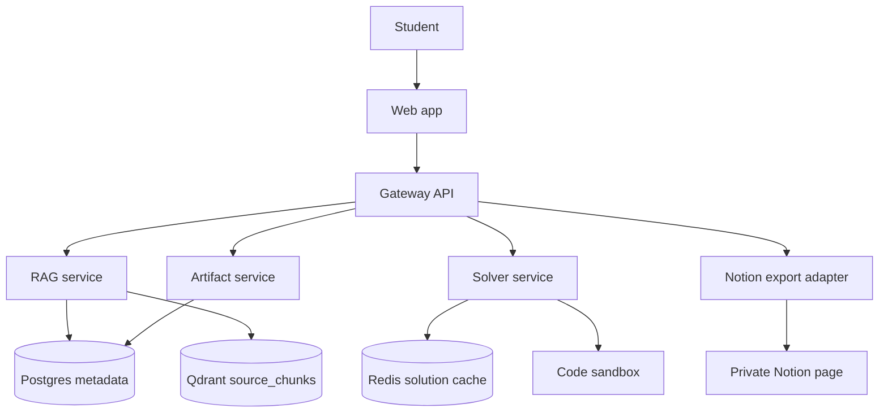
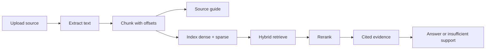
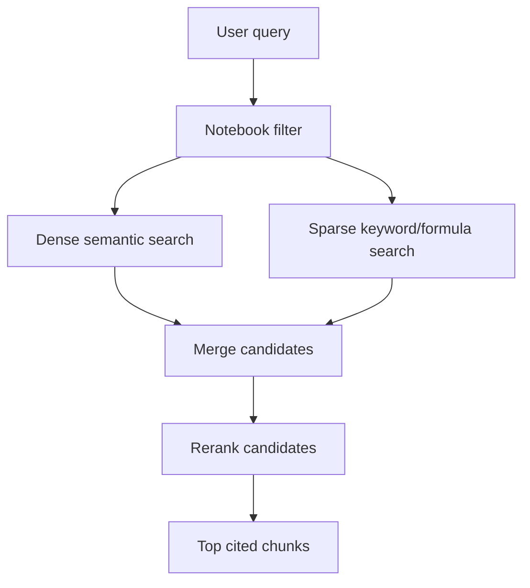
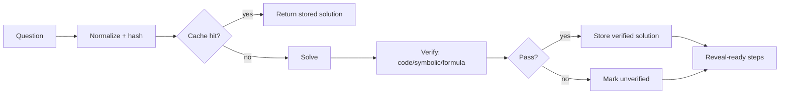
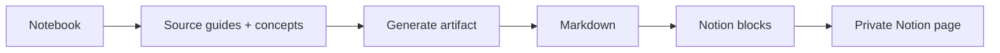

# Architecture Diagram

## Product overview

```mermaid
flowchart TD
    U[Student] --> WEB[Web app]
    WEB --> GW[Gateway API]
    GW --> RAG[RAG service]
    GW --> SOL[Solver service]
    GW --> ART[Artifact service]
    GW --> NOTION[Notion export adapter]

    RAG --> PG[(Postgres metadata)]
    RAG --> QD[(Qdrant source_chunks)]
    SOL --> REDIS[(Redis solution cache)]
    SOL --> SBX[Code sandbox]
    ART --> PG
    NOTION --> NPAGE[Private Notion page]
```

## Notebook RAG pipeline

```mermaid
flowchart LR
    UP[Upload source] --> EXT[Extract text]
    EXT --> CH[Chunk with offsets]
    CH --> SG[Source guide]
    CH --> IDX[Index dense + sparse]
    IDX --> HYB[Hybrid retrieve]
    HYB --> RR[Rerank]
    RR --> CITE[Cited evidence]
    CITE --> ANS[Answer or insufficient support]
```

## Hybrid retrieval

```mermaid
flowchart TD
    Q[User query] --> NF[Notebook filter]
    NF --> DS[Dense semantic search]
    NF --> SS[Sparse keyword/formula search]
    DS --> MERGE[Merge candidates]
    SS --> MERGE
    MERGE --> RERANK[Rerank candidates]
    RERANK --> TOP[Top cited chunks]
```

## Solver pipeline

```mermaid
flowchart LR
    Q[Question] --> H[Normalize + hash]
    H --> C{Cache hit?}
    C -- yes --> STORED[Return stored solution]
    C -- no --> S[Solve]
    S --> V[Verify: code/symbolic/formula]
    V --> P{Pass?}
    P -- yes --> SAVE[Store verified solution]
    P -- no --> UN[Mark unverified]
    SAVE --> REVEAL[Reveal-ready steps]
    UN --> REVEAL
```

## Artifact and Notion flow

```mermaid
flowchart LR
    NB[Notebook] --> GUIDES[Source guides + concepts]
    GUIDES --> ART[Generate artifact]
    ART --> MD[Markdown]
    MD --> BLOCKS[Notion blocks]
    BLOCKS --> PAGE[Private Notion page]
```
